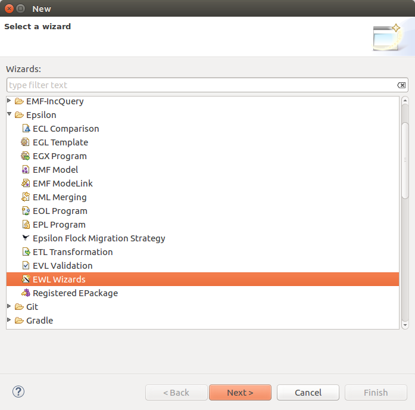
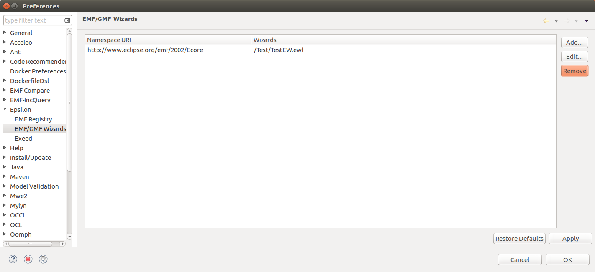

# Epsilon Query Language and Sirius integration

This plugin allow to integrate EWL (Epsilon Wizard Language and Sirius.

Constructing and refactoring models is undoubtedly a mentally intensive process. However,
during modeling, recurring patterns of model update activities typically appear. As
an example, when renaming a class in a UML class diagram, the user also needs to manually
update the names of association ends that link to the renamed class. Thus, when
renaming a class from Chapter to Section, all associations ends that point to the class and
are named chapter or chapters should be also renamed to section and sections respectively.

EWL proposes a pragmatic approach for defining these refactorings. 
EWL provides an integration with EMF and GMF. this plugin simples add an integration with Sirius. 

You can use it to provide refactoring for any EMF model conforming to any Ecore metamodel. 


## How to use it. 

### Step 1: install your dependencies


1. Install Epsilon Query Language and its support for GMF (Eclipse Market place). 
2. Install Sirius (Eclipse Market place)
3. Install the provided plugin. 


### Step 2: Define your refactoring

Write a simple EWL script. You can follow this [simple example](https://epsilonblog.wordpress.com/2008/01/18/model-refactoring-in-gmf-based-editors-with-ewl/#comment-9) to write a simple refactoring. 


To create an EWL File, File -> other -> epsilon -> new EWL Wizards (See figure below). 



*Create your refactoring.*

The wizard definition contains mainly three parts. 

1. The *guard* defines in which condition this refactoring can be applied. 
2. The *description* allows developers to define a short human-readable description
of its functionality.
3. The *do* section implements the refactoring. 

You can easily defines user inputs using * UserInput.prompt*

The provided example just renames two ecore classes. 

```java

wizard RenameTwoClassesCase {

guard : self.isKindOf(Collection) and
self.size() = 2 and  self.forAll(s|s.isTypeOf(ecore::EClass))

title : 'Rename resource ' + self.at(0).name + ' and ' + self.at(1).name

do {
	var class1 := self.at(0);
	var class2 := self.at(1);
	var newName = UserInput.prompt("New Name for Class " + class1.name);
	class1.name := newName;
	var newName1 = UserInput.prompt("New Term for Class " + class2.name);
	class2.name := newName1;	
	}

}

```

### Step 3: Activate your refactoring

Go to the preference page (Window -> preference)

Go to the epsilon page and add your EWL file. (See figure below)




### Step 4: Test your refactoring

In the Sirius Ecore editor, select two classes and right click to get the contextual menu, Select wizards and the name of your refactoring. 


